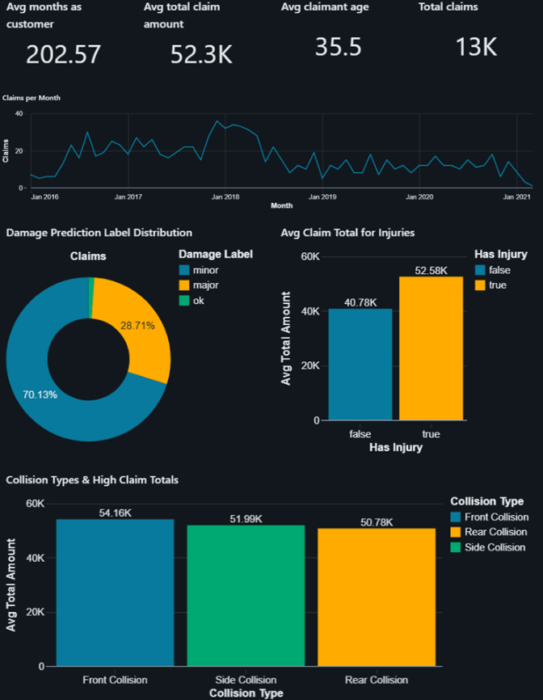
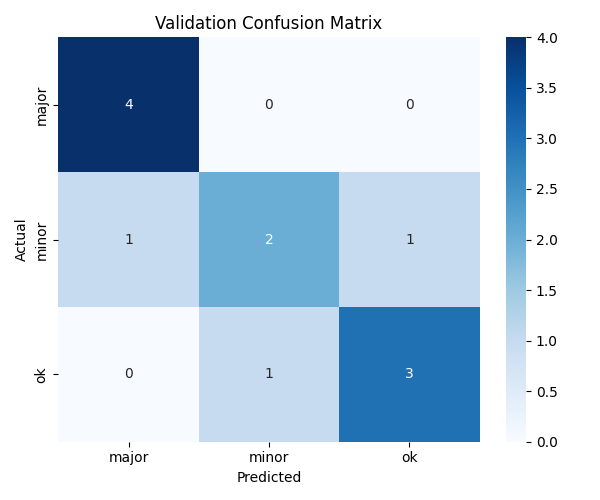

# Insurance Claims Intelligence Databricks Pipeline
An end-to-end data engineering and machine learning project built on Databricks that automates insurance claim processing using a medallion architecture, computer vision, and a rules-based decision engine.

## Overview
When a customer files an insurance claim, they upload a photo of the damage and declare a severity level. This pipeline ingests that data, trains a computer vision model to independently assess the damage, and compares the model's verdict against the customer's declaration. Claims where both match are flagged for automatic fund release. Mismatches are flagged for human review.
The project demonstrates a complete production-style data pipeline: from raw ingestion through to a governed Gold layer with an actionable insights dashboard without requiring paid infrastructure beyond Databricks Free Tier and Google Colab.

## Architecture

Raw Sources
├── Supabase PostgreSQL  →  customers, policies, claims
├── Databricks Volumes   →  crash images (training), claim images (inference)
└── Parquet Files        →  telematics driving data

          ↓  Bronze Layer (raw ingestion)
          ↓  Silver Layer (cleaning, joins, transformations)
          ↓  Gold Layer   (aggregations, predictions, decisions)

The pipeline follows the medallion architecture using Delta Live Tables (DLT), Auto Loader, and scheduled Databricks Jobs. A machine learning stage fine-tunes a ResNet-50 model in Google Colab and uploads the trained weights back to Databricks for batch inference.

## Machine Learning

1- Export (Export_Training_Data.py): Resizes training images to 224×224 pixels using a Pandas UDF and exports the Silver table as Parquet files to a Databricks Volume for external access
2- Training (ML_Notebook.ipynb): Run in Google Colab (T4 GPU). Loads exported Parquet files, fine-tunes a pre-trained ResNet-50 model for three-class damage classification (major, minor, ok), tracks experiments and metrics with MLflow pointing to the Databricks workspace, and uploads trained model weights and label mapping back to the Volume
3- Model: microsoft/resnet-50 fine-tuned via PyTorch and HuggingFace torchvision. Final layer replaced to output 3 classes.

## Repository Structure

databricks-end-to-end-pipeline/
├── ingestion/
│   ├── bronze_supabase_ingestion.py     # Incremental JDBC ingestion from Supabase
│   ├── autoloader_claims.py             # Auto Loader for claim images and metadata
│   └── bronze_ingestion.py              # DLT Auto Loader for telematics parquet files
│
├── transformations/
│   ├── bronze_to_silver.py              # DLT pipeline: cleaning and joining
│   └── silver_to_gold.py                # DLT pipeline: aggregations and enrichment
│
├── ml/
│   ├── Export_Training_Data.py          # Databricks: resize images and export to DBFS
│   └── ML_Notebook.ipynb                # Google Colab: fine-tune ResNet-50, log to MLflow
│
├── inference/
│   └── Inference_and_Decision.py        # Batch inference + rules engine → Gold table
│
├── jobs/
│   └── end_to_end_pipeline_job.yml      # Databricks Job orchestration config
│
├── pipelines/
│   ├── telematics_pipeline.yml          # DLT pipeline config for telematics ingestion
│   └── transformations_pipeline.yml     # DLT pipeline config for Silver/Gold transforms
└── datasets/                            # Not tracked in Git — see datasets note below
    ├── claims/
    │   ├── images/                      # Excluded via .gitignore
    │   └── metadata/
    │       └── image_metadata.csv       # Excluded via .gitignore
    └── training_imgs/
        └── images/                      # Excluded via .gitignore

## Datasets
Sample images and metadata are not tracked in this repository due to file size. 
To run the pipeline, populate the following folders manually before executing 
the ingestion notebooks:
- `datasets/claims/images/` — customer claim photos (JPG)
- `datasets/claims/metadata/image_metadata.csv` — claim metadata
- `datasets/training_imgs/images/` — labelled training images organised by damage class

## How to Run

### Prerequisites

Databricks Free Tier workspace with Unity Catalog enabled
Supabase project with customers, policies, and claims tables
Google Colab account (free tier sufficient with T4 GPU runtime)
GitHub account

### Steps

1- Set up volumes in main.default — claims_vol and training_imgs_vol with the folder structure shown above
2- Upload training images to training_imgs_vol/crash_images/ organised into subfolders by label
3- Configure Supabase credentials in bronze_supabase_ingestion.py
4- Create and run DLT pipelines for telematics ingestion and Bronze→Silver→Gold transformations
5- Run Export_Training_Data.py in Databricks to resize images and export Parquet files
6- Download the exported Parquet files from the Volume UI and upload to Google Colab
7- Run ML_Notebook.ipynb in Colab with T4 GPU runtime — model weights upload back to the Volume automatically on completion
8- Run Inference_and_Decision.py in Databricks to generate workspace.gold.claim_insights
9- Schedule the job using the config in jobs/end_to_end_pipeline_job.yml to run all tasks daily in sequence
